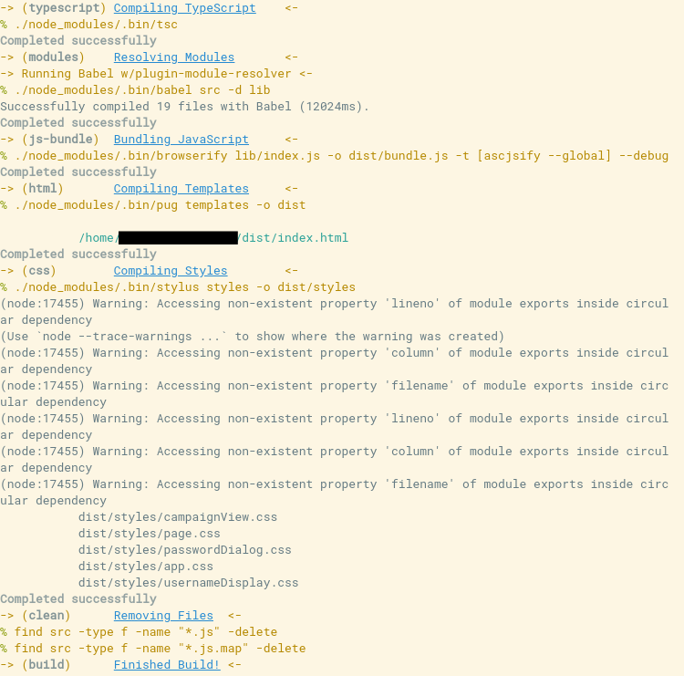

# Bettermake
## Make your makefiles better
### Get started
#### With a git repository
If you haven't got submodules, initialize them:
```
$ git submodule init
```

Then, add this repository to yours:

```
$ git submodule add https://github.com/munchkinhalfling/bettermake.git bettermake
```

Now, add the `path.mk` file to the top of your makefile and the `main.mk` file to the bottom:
```Makefile
include ./bettermake/path.mk
...
include ./bettermake/main.mk
```
#### Without a git repository
Simply clone this repository into your working directory:
```
$ git clone https://github.com/munchkinhalfling/bettermake.git
```
Now, follow the Makefile instructions above.

### Building
First, compile Bettermake for your machine:
```
$ make bettermake/compile
```
Then, run `make` like you usually would.

### Command reference
#### `header`
Print out a recipe header. \
Usage: `@header <recipe name> "<recipe description>"` \
Example: `@header build "Building everything..."`

#### `detail`
Print out a detail message. \
Usage: `@detail "<message>"` \
Example: `@detail "Deporting tribbles..."`

#### `command`
Run a command. \
Usage: `@command '<command>' [flags]` \
Example: `@command 'find tribbles -delete'` \
The only flag is `quiet`, which stops it from outputting the exit code.

### Example makefile
Used for one of my private projects.
```Makefile
include ./bettermake/path.mk
.PHONY: all
npmbin = ./node_modules/.bin
PACKMAN = npm
all: build
install-deps:
	@header install-deps "Installing NPM Dependencies"
	@detail "Package manager is $(PACKMAN)"
	@command '$(PACKMAN) install'


typescript:
	@header typescript "Compiling TypeScript"
	@command '$(npmbin)/tsc'

modules: typescript
	@header modules "Resolving Modules"
	@detail 'Running Babel w/plugin-module-resolver'
	@command '$(npmbin)/babel src -d lib'

js-bundle: modules
	@header js-bundle "Bundling JavaScript"
	@command '$(npmbin)/browserify lib/index.js -o dist/bundle.js -t [ascjsify --global] --debug'

html:
	@header html "Compiling Templates"
	@command '$(npmbin)/pug templates -o dist'

css:
	@header css "Compiling Styles"
	@command '$(npmbin)/stylus styles -o dist/styles'

build: js-bundle html css clean
	@header build "Finished Build!"
serve: build
	@header serve "Starting Browsersync"
	@command 'cd dist && ../$(npmbin)/browser-sync start --server --files "dist/*" --index index.html'

clean:
	@header clean "Removing Files"
	@command 'find src -type f -name "*.js" -delete' quiet
	@command 'find src -type f -name "*.js.map" -delete' quiet

clean-all: clean
	@header clean-all "Removing All Files"
	@command 'find dist -delete' quiet
	@command 'mkdir dist' quiet
	@command 'find lib -delete' quiet
	@command 'mkdir lib' quiet
clean-deps:
	@header clean-deps "Removing node_modules"
	@command 'find node_modules -delete' quiet

help-recipes:
	@echo -e \\e[32m--------\\e[0m
	@echo -e \\e[1\;33mRecipes:\\e[0m
	@echo -e \\e[32m--------\\e[0m
	@echo -e \\e[1minstall-deps:\\e[0m Install NPM dependencies
	@echo -e \\e[1mbuild:\\e[0m Build Webapp
	@echo -e \\e[1mserve:\\e[0m Build \& Serve
	@echo -e \\e[1mclean:\\e[0m Clean JS from src
	@echo -e \\e[1mclean-all:\\e[0m Clean everything
	@echo -e \\e[1mclean-deps:\\e[0m Clean node_modules
	@echo -e \\e[1mall \(\\e[32m.PHONY\\e[0m\\e[1m\):\\e[0m see \'build\'
	@echo -e \\e[1mhelp-recipes:\\e[0m Show this message
	@echo -e \\e[32m--------------\\e[0m
	@echo -e \\e[1\;33mBuild Targets:\\e[0m
	@echo -e \\e[32m--------------\\e[0m
	@echo -e \\e[1mtypescript:\\e[0m Build Typescript
	@echo -e \\e[1mmodules \(\\e[32mtypescript\\e[0m\\e[1m\):\\e[0m Resolve Modules
	@echo -e \\e[1mjs-bundle \(\\e[32mtypescript, modules\\e[0m\\e[1m\):\\e[0m Bundle JavaScript w\/ Browserify
	@echo -e \\e[1mhtml:\\e[0m Convert Pug to HTML
	@echo -e \\e[1mcss:\\e[0m Build Stylus
	@echo -e \\e[32m----------\\e[0m
	@echo -e \\e[1\;33mVariables:\\e[0m
	@echo -e \\e[32m----------\\e[0m
	@echo -e \\e[1mPACKMAN \(\\e[32minstall-deps\\e[0m\\e[1m\):\\e[0m Package manager to use. Default is \'npm\'. \(eg. \'yarn\', \'pnpm\', \'npm\', etc.\)
include bettermake/main.mk
```
#### Output
</img>
